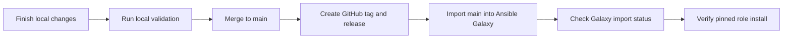

# Ansible Galaxy Release Runbook

This runbook describes how to publish the standalone `inviqa.jumpcloud`
Ansible role to Ansible Galaxy after a GitHub release is ready.

Use the current release version wherever the examples show `3.0.0`.

## Release Flow



## Release Order

1. Finish and validate the repository changes locally.
2. Merge the release branch to `main`.
3. Create the GitHub release and SemVer tag.
4. Import `main` into Ansible Galaxy.
5. Verify the Galaxy role metadata and pinned install path.

Ansible Galaxy imports standalone role releases from GitHub. The role version is
discovered from Git tags that match Semantic Versioning.

## Local Preflight

Run the repository checks that apply to the release changes. At minimum, use the
targeted linters for changed files and run the role lint before publishing:

```bash
ws ansible-lint
markdownlint -c ~/.markdownlint.json README.md CHANGELOG.md docs/ansible-galaxy-release.md
```

For releases that change runtime behavior, also run the relevant syntax,
container, Jenkins, or live-test workflows documented in
[Testing](testing.md) and [Jenkins CI](jenkins-ci.md).

## GitHub Release

Before importing into Galaxy:

1. Ensure `CHANGELOG.md` has a release-ready entry.
2. Ensure major releases link to an upgrade guide when they contain breaking
   changes.
3. Merge the release branch to `main`.
4. Tag the release with the same SemVer version that Galaxy should expose.
5. Push `main` and the tag to GitHub.
6. Create the GitHub release from the tag.

For example, a `3.0.0` release should include the breaking changes and
[Upgrading to 3.0.0](upgrading-to-3.0.0.md) link in the GitHub release body.

## Ansible Galaxy Token

The Workspace publication commands read the Galaxy token from
`workspace.override.yml`:

```ruby
attribute('ansible.galaxy.token'): 'your-token'
```

The same commands also accept `ANSIBLE_GALAXY_TOKEN` from the shell
environment. If neither value is set, publish and import-status checks fail
with a clear message.

## Publish to Galaxy

After the GitHub release and tag exist on `main`, run:

```bash
ws ansible-galaxy publish
```

This imports the role with the repository's fixed Galaxy publication settings:

- namespace: `inviqa`
- GitHub repository: `inviqa/ansible-jumpcloud`
- branch: `main`
- Galaxy role name: `jumpcloud`

The command also prints `ansible-galaxy role info inviqa.jumpcloud` after a
successful import.

## Inspect Galaxy State

Check the currently indexed role metadata without a token:

```bash
ws ansible-galaxy info
```

Check the latest import status with a token:

```bash
ws ansible-galaxy status
```

After import, confirm that Galaxy reports:

- `github_branch: main`
- the latest release commit or tag commit
- the updated role description from `meta/main.yml`
- the expected version in the Galaxy UI

## Verify Installation

After Galaxy finishes importing the release, verify a pinned install in a clean
temporary directory:

```bash
version="3.0.0"
tmp_dir="$(mktemp -d)"
ansible-galaxy role install --roles-path "${tmp_dir}" "inviqa.jumpcloud,${version}"
find "${tmp_dir}" -maxdepth 2 -type f -name main.yml
rm -rf "${tmp_dir}"
```

For future releases, replace `3.0.0` with the release tag.

## Troubleshooting

- If Galaxy still reports `github_branch: master`, rerun
  `ws ansible-galaxy publish` after confirming the GitHub default branch is
  `main`.
- If Galaxy does not show the new version, confirm the tag was pushed to GitHub
  and matches SemVer.
- If `ws ansible-galaxy status` fails without a token, set
  `ansible.galaxy.token` in `workspace.override.yml`.
- If the role description or tags look stale, confirm `meta/main.yml` is merged
  into `main`, then reimport the role.
