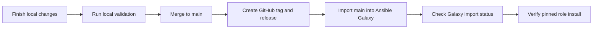

# Ansible Galaxy Release Runbook

This runbook describes how to publish the standalone `inviqa.jumpcloud`
Ansible role to Ansible Galaxy after a GitHub release is ready.

Use the current release version wherever the examples show `3.0.0`.

## Release Flow



## Release Order

1. Finish and validate the repository changes locally.
2. Merge the release branch to `main`.
3. Create the GitHub release and SemVer tag.
4. Import `main` into Ansible Galaxy.
5. Verify the Galaxy role metadata and pinned install path.

Ansible Galaxy imports standalone role releases from GitHub. The role version is
discovered from Git tags that match Semantic Versioning.

## Local Preflight

Run the repository checks that apply to the release changes. At minimum, use the
targeted linters for changed files and run the role lint before publishing:

```bash
ws ansible-lint
markdownlint -c ~/.markdownlint.json README.md CHANGELOG.md docs/ansible-galaxy-release.md
```

For releases that change runtime behavior, also run the relevant syntax,
container, Jenkins, or live-test workflows documented in
[Testing](testing.md) and [Jenkins CI](jenkins-ci.md).

## GitHub Release

Before importing into Galaxy:

1. Ensure `CHANGELOG.md` has a release-ready entry.
2. Ensure major releases link to an upgrade guide when they contain breaking
   changes.
3. Merge the release branch to `main`.
4. Tag the release with the same SemVer version that Galaxy should expose.
5. Push `main` and the tag to GitHub.
6. Create the GitHub release from the tag.

For example, a `3.0.0` release should include the breaking changes and
[Upgrading to 3.0.0](upgrading-to-3.0.0.md) link in the GitHub release body.

Check whether the latest concrete changelog release already exists on GitHub:

```bash
ws github release check
```

If the release exists, the command exits successfully. If the changelog release
exists locally but is not published on GitHub yet, the command exits with code
`2` and tells the operator to publish it.

Publish the latest concrete changelog release to GitHub:

```bash
ws github release publish
```

Set `RELEASE_VERSION` to target a specific changelog section:

```bash
RELEASE_VERSION=3.0.0 ws github release check
RELEASE_VERSION=3.0.0 ws github release publish
```

## Ansible Galaxy Token

Use the current Galaxy token page:

```text
https://galaxy.ansible.com/ui/token/
```

The Ansible CLI reference still points at the older
`https://galaxy.ansible.com/me/preferences` path for `--token` and
`--api-key`, but that page is no longer the usable token-management entry point
for this release workflow.

The current Galaxy NG documentation describes token management through the UI:
log in, open token management, select `Load Token`, then copy the generated
token. The same documentation warns that loading a token invalidates the
previous token, so regenerating the Galaxy token requires updating Jenkins too.

The Workspace publication commands read the Galaxy token from
`workspace.override.yml`:

```ruby
attribute('ansible.galaxy.token'): 'your-token'
attribute('github.api_token'): 'your-token'
```

The same commands also accept `ANSIBLE_GALAXY_TOKEN` from the shell
environment for Galaxy and `GITHUB_TOKEN` for GitHub.

Official Galaxy documentation describes tokens as user-account tokens. It does
not document a separate public Galaxy machine-user or service-account token
type. For a Jenkins token that should not belong to a person, use a dedicated
operational GitHub account when company policy allows it:

1. Create or use a GitHub account reserved for Ansible role publishing.
2. Grant that account the GitHub repository access required by the release
   workflow.
3. Log in to Galaxy with that GitHub account, because Galaxy documents GitHub
   social login as the supported login path.
4. Ensure the Galaxy account can import into the required namespace or role.
   Namespace ownership may need to be granted by an existing namespace owner.
5. Open `https://galaxy.ansible.com/ui/token/` while logged in as that account.
6. Select `Load Token`, copy the token once, and store it in Jenkins as the
   `ansible-jumpcloud-galaxy-token` Secret text credential.

If a dedicated GitHub publishing account is not allowed, use a maintainer-owned
Galaxy token as an explicit operational exception and rotate it when the
maintainer changes role. Do not use a personal token silently for Jenkins.

For local release testing without `workspace.override.yml`, export a personal
GitHub token before running the Workspace command:

```bash
export GITHUB_TOKEN="your-token"
ws github release check
```

## Publish to Galaxy

After the GitHub release and tag exist on `main`, run:

```bash
ws ansible-galaxy publish
```

This imports the role with the repository's fixed Galaxy publication settings:

- namespace: `inviqa`
- GitHub repository: `inviqa/ansible-jumpcloud`
- branch: `main`
- Galaxy role name: `jumpcloud`

The command also prints `ansible-galaxy role info inviqa.jumpcloud` after a
successful import.

## Jenkins Publication

Jenkins can publish the GitHub release and import the role into Galaxy after a
successful `main` build. The two publication steps are separate stages
controlled by Jenkins build parameters.

Jenkins needs these credentials:

| Credential ID | Jenkins type | Purpose |
| --- | --- | --- |
| `inviqa-ansible-roles-releases` | Secret text | Creates the GitHub release in `inviqa/ansible-jumpcloud`. |
| `ansible-jumpcloud-galaxy-token` | Secret text | Imports the role into Ansible Galaxy. Prefer a token loaded by a dedicated Galaxy publishing account rather than a personal maintainer account. |

The release stage derives the release notes from `CHANGELOG.md`. Set
`RELEASE_VERSION` to publish a specific changelog section, or leave it empty to
use the latest concrete release section.
The Galaxy stage resolves the same version, checks that the matching Git tag
exists on `origin`, exits without importing if the version is already visible on
Galaxy, otherwise imports the role and verifies the version with a pinned Galaxy
install.
Both Jenkins publication stages call Workspace commands directly:

```bash
ws github release publish
ws ansible-galaxy publish
```

This keeps Jenkins as an orchestrator only. The release checks and publication
behavior remain reusable from a local checkout.

| Parameter | Default | Purpose |
| --- | --- | --- |
| `PUBLISH_GITHUB_RELEASE` | `true` | Create the GitHub release from `CHANGELOG.md` on `main`. |
| `PUBLISH_ANSIBLE_GALAXY_RELEASE` | `true` | Import the `main` branch into Ansible Galaxy when the version is not already visible. |

Keep both parameters enabled for the normal release path. Disable GitHub
publication when the GitHub release already exists and the role only needs a
Galaxy reimport.

## Inspect Galaxy State

Check the currently indexed role metadata without a token:

```bash
ws ansible-galaxy info
```

Check the latest import status with a token:

```bash
ws ansible-galaxy status
```

After import, confirm that Galaxy reports:

- `github_branch: main`
- the latest release commit or tag commit
- the updated role description from `meta/main.yml`
- the expected version in the Galaxy UI
- a successful pinned install for the release version

## Verify Installation

After Galaxy finishes importing the release, verify a pinned install in a clean
temporary directory:

```bash
version="3.0.0"
tmp_dir="$(mktemp -d)"
ansible-galaxy role install --roles-path "${tmp_dir}" "inviqa.jumpcloud,${version}"
find "${tmp_dir}" -maxdepth 2 -type f -name main.yml
rm -rf "${tmp_dir}"
```

For future releases, replace `3.0.0` with the release tag.

## Troubleshooting

- If Galaxy still reports `github_branch: master`, rerun
  `ws ansible-galaxy publish` after confirming the GitHub default branch is
  `main`.
- If Galaxy does not show the new version, confirm the tag was pushed to GitHub
  and matches SemVer.
- If Jenkins fails before importing Galaxy, confirm `RELEASE_VERSION` matches a
  concrete `CHANGELOG.md` section and a pushed Git tag.
- If `ws github release check` exits with code `2`, run
  `ws github release publish` or create the GitHub release manually before the
  Galaxy import.
- If `ws ansible-galaxy status` fails without a token, set
  `ansible.galaxy.token` in `workspace.override.yml`.
- If Jenkins starts failing after a Galaxy token was reloaded in the UI, update
  the `ansible-jumpcloud-galaxy-token` Secret text credential. Galaxy invalidates
  the previous token when a new one is loaded.
- If the role description or tags look stale, confirm `meta/main.yml` is merged
  into `main`, then reimport the role.

## Official References

- [Galaxy NG user guide](https://docs.ansible.com/projects/galaxy-ng/en/latest/community/userguide.html)
  documents GitHub login, UI token loading, and token invalidation.
- [Galaxy NG API V3](https://docs.ansible.com/projects/galaxy-ng/en/latest/community/api_v3.html)
  documents token authentication for API calls.
- [Ansible Galaxy CLI reference](https://docs.ansible.com/projects/ansible/latest/cli/ansible-galaxy.html)
  documents `--token` and `--api-key`, but currently still points at the older
  `/me/preferences` token URL.
