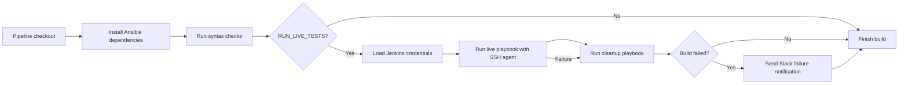

# Jenkins CI integration

This repository includes a `Jenkinsfile` for running the same Ansible syntax
checks and DigitalOcean-backed JumpCloud integration flow used during local
maintenance.

## Pipeline coverage

The pipeline runs inside a Jenkins-native Docker agent and executes:

- Python and Ansible dependency installation from `tests/requirements.txt` and
  `tests/requirements.yml`
- the tracked `tests/roles/ansible-jumpcloud` symlink so Ansible can resolve the
  checked-out role by name in Jenkins job workspaces
- syntax checks for the Docker inventory and DigitalOcean live-test inventory
- the live DigitalOcean JumpCloud test matrix with `tests/playbook.yml`
- cleanup with `tests/playbook_cleanup.yml`, even when the live test stage fails
- failure notification to the `ops-integrations` Slack channel

The live test stage provisions real DigitalOcean droplets and registers real
systems in JumpCloud, so it incurs provider cost while it runs.

The Jenkins pipeline mirrors the local live-test path, with cleanup wired into
the live-test stage so provider resources are removed after a failed run too.



Markdown, YAML, and full `ws ansible-lint` checks are intentionally kept as
pre-handoff checks rather than Jenkins pipeline stages.

## Jenkins Docker agent

The Jenkinsfile follows the Jenkins-native Docker workflow used by the
DigitalOcean reserved IP role. Jenkins runs the pipeline inside the shared
Inviqa Ansible image:

```text
quay.io/inviqa_images/ansible:2.15-python3.10-trixie
```

The pipeline installs the Python dependencies needed by the DigitalOcean
collection, installs Ansible collections into `.ansible/collections`, and runs
the Ansible commands directly.

## Jenkins setup

Create a pipeline job that uses the repository `Jenkinsfile`.

Recommended Jenkins configuration:

- Agent label: `linux-amd64`
- Required tools on the agent:
  - Docker
  - `ssh-agent`
- Required Jenkins credentials:
  - DigitalOcean API token
  - DigitalOcean SSH key IDs or fingerprints used for test droplets
  - JumpCloud connect key
  - JumpCloud API key
  - SSH private key matching the DigitalOcean SSH key configured for droplets
  - Slack token credential used for failure notifications

The credential ID placeholders are defined at the top of `Jenkinsfile`:

| Placeholder | Jenkins credential type | Purpose |
| --- | --- | --- |
| `ansible-jumpcloud-digitalocean-oauth-token` | Secret text | DigitalOcean API token. |
| `ansible-jumpcloud-digitalocean-ssh-key-ids` | Secret text | Comma or newline separated DigitalOcean SSH key IDs or fingerprints. |
| `ansible-jumpcloud-connect-key` | Secret text | JumpCloud connect key for agent registration. |
| `ansible-jumpcloud-api-key` | Secret text | JumpCloud API key for cleanup, updates, and verification. |
| `ansible-roles-test-ssh-private-key` | SSH username with private key | Private key loaded for live test droplet access. |
| `inviqa-slack-integration-token` | Secret text | Slack token used for Jenkins failure notifications. |

## Parameters

| Parameter | Default | Purpose |
| --- | --- | --- |
| `RUN_LIVE_TESTS` | `true` | Enables the DigitalOcean-backed JumpCloud integration test stage. |
| `TEST_INVENTORY` | `tests/inventory-digitalocean-droplets` | Fixed inventory choice used by the live test and cleanup playbooks. |

When `RUN_LIVE_TESTS` is enabled, all non-Slack credentials above must exist.

The pipeline sends failure notifications only. Successful builds do not post to
Slack.

## Jenkinsfile lint

Validate the Jenkinsfile locally before pushing pipeline changes:

```text
ws lint-jenkinsfile
```

The Workspace command starts the `console` and `jenkins-lint` Compose services,
then runs the helper inside the console container.

## Local equivalent

The Jenkinsfile mirrors the Workspace test sequence:

```text
ws syntax
ws test-live
```
