# Jenkins CI integration

This repository includes a `Jenkinsfile` for running the same Ansible syntax
checks and DigitalOcean-backed JumpCloud integration flow used during local
maintenance.

## Pipeline coverage

The pipeline runs on a Jenkins node with Workspace installed and executes:

- Workspace environment startup with `ws enable`
- role linting through `ws ansible-lint`
- the tracked `tests/roles/ansible-jumpcloud` symlink so Ansible can resolve the
  checked-out role by name in Jenkins job workspaces
- syntax checks through `ws syntax`
- container-backed role validation through `ws test-docker`
- non-mutating release preflight checks for GitHub release readiness and
  Ansible Galaxy token configuration and read access
- the live DigitalOcean JumpCloud test matrix through `ws test-live`
- optional GitHub release creation from `main`
- optional Ansible Galaxy import from `main`
- failure notification to the `ops-integrations` Slack channel

The live test stage provisions real DigitalOcean droplets and registers real
systems in JumpCloud, so it incurs provider cost while it runs.

The Jenkins pipeline mirrors the local live-test path, with cleanup wired into
the live-test stage so provider resources are removed after a failed run too.

```mermaid
flowchart LR
  accTitle: Jenkins live-test pipeline
  accDescr: Shows the Jenkins stages and cleanup handoff for live tests.
  checkout["Pipeline checkout"] --> build["Run ws enable"]
  build --> lint["Run ws ansible-lint"]
  lint --> syntax["Run ws syntax"]
  syntax --> container["Run ws test-docker"]
  container --> preflight["Run release preflight"]
  preflight --> gate{"RUN_LIVE_TESTS?"}
  gate -->|No| finish["Finish build"]
  gate -->|Yes| live["Run ws test-live with SSH agent"]
  live --> github_gate{"Publish GitHub release on main?"}
  github_gate -->|Yes| github_release["Create GitHub release"]
  github_gate -->|No| galaxy_gate{"Publish Galaxy release on main?"}
  github_release --> galaxy_gate
  galaxy_gate -->|Yes| galaxy_release["Import Galaxy role"]
  galaxy_gate -->|No| notify{"Build failed?"}
  galaxy_release --> notify
  notify -->|Yes| slack["Send Slack failure notification"]
  notify -->|No| finish
  slack --> finish
```



Markdown and YAML checks are intentionally kept as pre-handoff checks rather
than Jenkins pipeline stages.

## Jenkins Workspace agent

The Jenkinsfile follows this repository's Workspace-first maintenance pattern.
Jenkins runs on a `linux-amd64` node where the Workspace CLI is already
available. The pipeline calls `ws enable`, and Workspace starts the Docker
Compose services that provide the Ansible execution environment.

The Workspace `console` image installs the Python dependencies from
`tests/requirements.txt` and Ansible collections from `tests/requirements.yml`.
Jenkins does not run Ansible directly on the host.

## Jenkins setup

Create a pipeline job that uses the repository `Jenkinsfile`.

Recommended Jenkins configuration:

- Agent label: `linux-amd64`
- Required tools on the agent:
  - Docker
  - `ssh-agent`
  - Workspace CLI `ws`
- Required Jenkins credentials:
  - DigitalOcean API token
  - DigitalOcean SSH key IDs or fingerprints used for test droplets
  - JumpCloud connect key
  - JumpCloud API key
  - SSH private key matching the DigitalOcean SSH key configured for droplets
  - Slack token credential used for failure notifications
  - GitHub API token with write access to `inviqa/ansible-jumpcloud`
  - Ansible Galaxy API token for the `inviqa` namespace, preferably loaded by a
    dedicated publishing account rather than a personal maintainer account

The credential bindings and Workspace-facing environment variables are defined
at the top of `Jenkinsfile`:

| Placeholder | Jenkins credential type | Purpose |
| --- | --- | --- |
| `inviqa-ansible-roles-releases` | Secret text | GitHub API token used to create the release in `inviqa/ansible-jumpcloud`. |
| `ansible-jumpcloud-galaxy-token` | Secret text | Ansible Galaxy API token used to import the role after the GitHub release exists. |
| `ansible-roles-digitalocean-oauth-token` | Secret text | DigitalOcean API token. |
| `ansible-roles-tests-digitalocean-ssh-key-id` | Secret text | Comma-separated DigitalOcean SSH key IDs or fingerprints. |
| `ansible-jumpcloud-connect-key` | Secret text | JumpCloud connect key for agent registration. |
| `ansible-jumpcloud-api-key` | Secret text | JumpCloud API key for cleanup, updates, and verification. |
| `ansible-roles-test-ssh-private-key` | SSH username with private key | Private key loaded for live test droplet access. |
| `inviqa-slack-integration-token` | Secret text | Slack token used for Jenkins failure notifications. |

## Jenkins parameters

Release publication and live-test scope are controlled by Jenkins build
parameters:

| Parameter | Default | Purpose |
| --- | --- | --- |
| `RUN_LIVE_TESTS` | `true` | Enables the DigitalOcean-backed JumpCloud integration test stage. |
| `LIVE_TEST_TARGET` | `all` | Target passed to `ws test-live`; valid values are `all`, `debian`, `redhat`, and `ubuntu`. |
| `RELEASE_VERSION` | empty | Optional release version to publish. When empty, Jenkins uses the latest concrete release section in `CHANGELOG.md`. |
| `PUBLISH_GITHUB_RELEASE` | `true` | Enables GitHub release publication on `main` after validation succeeds. |
| `PUBLISH_ANSIBLE_GALAXY_RELEASE` | `true` | Enables Ansible Galaxy import on `main` after validation succeeds. |

Jenkins shows these values on the job page through **Build with Parameters**.
Maintainers can change them for one build without editing `Jenkinsfile`; for
example, they can disable live tests, run only the `redhat` target, publish a
specific `RELEASE_VERSION`, or reimport Galaxy while skipping GitHub release
creation.

All credentials above must exist before the pipeline starts. Jenkins binds them
once in the top-level environment, and `ws console` is the single Workspace
entrypoint that forwards matching environment variables into commands executed
inside the `console` container.

Credentials are configured separately in Jenkins Credentials and are referenced
by the fixed credential IDs listed above. Change those IDs only when the Jenkins
job wiring changes; use build parameters for per-run operator choices.

Publication stages only run for the `main` branch. Pull request and
feature-branch builds cannot publish a release through this Jenkinsfile, even
when the publication parameters are enabled.

Galaxy documents API tokens as user-account tokens and does not document a
separate public machine-user token type. For Jenkins, the preferred operational
pattern is to log in to Galaxy with a dedicated GitHub publishing account, load
the token from `https://galaxy.ansible.com/ui/token/`, and store it as the
`ansible-jumpcloud-galaxy-token` Secret text credential. Reloading a Galaxy
token invalidates the previous one, so Jenkins must be updated whenever the
token is regenerated.

## Release preflight

Every Jenkins build runs a non-mutating release preflight before live tests:

```text
ws github release check
ws ansible-galaxy check-token
ws ansible-galaxy info
```

The GitHub check accepts exit code `0` when the release already exists and exit
code `2` when the changelog has a concrete release that is not published yet.
The latter is expected for a pull request that prepares a release.

The Galaxy checks validate token configuration, command wiring, and Galaxy API
read reachability without importing a new role release. The
`ws ansible-galaxy status` command remains available for manual import-status
diagnostics, but Jenkins does not use it as a preflight gate because Galaxy can
return transient server errors for the status endpoint.

## Release publication

The GitHub release stage only calls `ws github release publish`. That Workspace
command derives the release body from `CHANGELOG.md`, using `RELEASE_VERSION`
when provided or the latest concrete release section when it is left blank.

The Ansible Galaxy stage only calls `ws ansible-galaxy publish`. That Workspace
command checks the GitHub release first, exits without importing when the same
version is already visible on Galaxy, otherwise imports the `main` branch and
verifies the version with a pinned `ansible-galaxy role install`.

Enable both flags for the normal release path. Enable only the Galaxy flag when
the GitHub release already exists and the role only needs to be reimported.

Required data:

- GitHub repository: `inviqa/ansible-jumpcloud`
- GitHub credential ID: `inviqa-ansible-roles-releases`
- GitHub publication flag: `PUBLISH_GITHUB_RELEASE=true`
  - local equivalent: `ws github release publish`
- Ansible Galaxy credential ID: `ansible-jumpcloud-galaxy-token`
- Ansible Galaxy publication flag: `PUBLISH_ANSIBLE_GALAXY_RELEASE=true`
  - local equivalent: `ws ansible-galaxy publish`
- Galaxy GitHub owner/repository: `inviqa/ansible-jumpcloud`
- Galaxy branch: `main`
- Galaxy role name: `jumpcloud`
- Galaxy version check: pinned install of `inviqa.jumpcloud,<release-version>`

The GitHub release and Galaxy import runbook is documented in
[Ansible Galaxy Release Runbook](ansible-galaxy-release.md).

Keeping the publication logic in Workspace keeps Jenkins thin and lets
maintainers run the same checks and publication commands locally.

The pipeline sends failure notifications only. Successful builds do not post to
Slack.

## Jenkinsfile lint

Validate the Jenkinsfile locally before pushing pipeline changes:

```text
ws lint-jenkinsfile
```

The Workspace command starts the `console` and `jenkins-lint` Compose services,
then runs the helper inside the console container.

## Local equivalent

The Jenkinsfile mirrors the Workspace test sequence:

```text
ws enable
ws ansible-lint
ws syntax
ws test-docker
ws test-live all
```
