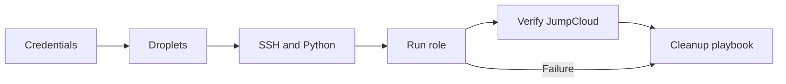
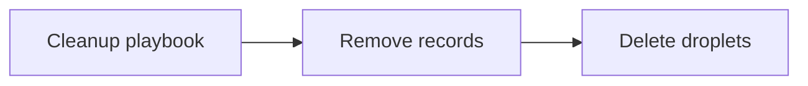

# Test Harness

This document describes the JumpCloud role test harness. Local test operations
run through Workspace, which owns the repository Docker Compose environment.

## Table of Contents

- [Coverage](#coverage)
- [Setup](#setup)
- [Workspace Commands](#workspace-commands)
- [Workspace Compose Environment](#workspace-compose-environment)
- [Container Tests](#container-tests)
- [DigitalOcean Live Tests](#digitalocean-live-tests)
- [Jenkinsfile Lint](#jenkinsfile-lint)
- [Clean Up](#clean-up)
- [Debian 13 Maintenance Check](#debian-13-maintenance-check)
- [Notes](#notes)

## Coverage

The default inventory exercises systemd-enabled container images:

| Family | Default image |
| --- | --- |
| Debian | `geerlingguy/docker-debian12-ansible:latest` |
| Enterprise Linux | `geerlingguy/docker-rockylinux9-ansible:latest` |
| Ubuntu | `geerlingguy/docker-ubuntu2404-ansible:latest` |

The container harness validates support-matrix and dependency-install behavior.
It intentionally does not run the real JumpCloud agent installer because that
device-management agent is not supported inside local Docker containers.

The DigitalOcean harness provisions real droplets for end-to-end validation:

| Family | DigitalOcean image slug |
| --- | --- |
| Debian | `debian-12-x64` |
| Debian unsupported-release validation | `debian-13-x64` |
| Enterprise Linux | `rockylinux-9-x64` |
| Ubuntu | `ubuntu-24-04-x64` |

## Setup

Install the Workspace CLI before running the test commands if `ws` is not
already available.

```bash
WS_VERSION=0.4.1
curl --output ./ws --location "https://github.com/my127/workspace/releases/download/${WS_VERSION}/ws"
chmod +x ws && sudo mv ws /usr/local/bin/ws
```

Workspace commands read local attributes from `workspace.override.yml`. Create
it from the example first:

```text
cp workspace.override.yml.example workspace.override.yml
```

Set the Workspace attributes needed for the commands you plan to run:

| Attribute | Used by | Purpose |
| --- | --- | --- |
| `test.digitalocean.api_token` | Live tests | DigitalOcean API token used to create and delete temporary Droplets. |
| `test.digitalocean.ssh_keys` | Live tests | DigitalOcean SSH key selectors to inject into temporary Droplets. |
| `test.digitalocean.project_name` | Live tests | Optional DigitalOcean project name for assigning temporary Droplets. |
| `test.jumpcloud.api_key` | Live tests | JumpCloud API key used for live agent registration checks and cleanup. |
| `test.jumpcloud.x_connect_key` | Live tests | JumpCloud connect key used by the agent registration flow. |
| `test.jumpcloud.system_groups` | Live tests | Optional comma-separated JumpCloud system groups to verify. |
| `test.jumpcloud.create_missing_system_groups` | Live tests | Whether the test may create missing requested JumpCloud system groups. |
| `test.jumpcloud.delete_duplicate_systems` | Live tests | Whether cleanup may remove stale JumpCloud systems with the same display name. |
| `ansible.galaxy.token` | Release commands | Ansible Galaxy API token used by token-required Galaxy checks, status, and import commands. |
| `github.api_token` | Release commands | GitHub API token used by GitHub release checks and publication commands. |

For example:

```ruby
attribute('test.digitalocean.api_token'): 'dop_v1_xxxxxxxxxxxxxxxxxxxxxxxxxxxxxxxx'
attribute('test.digitalocean.ssh_keys'): ['12345678']
attribute('test.digitalocean.project_name'): ''
attribute('test.jumpcloud.api_key'): 'your-jumpcloud-api-key'
attribute('test.jumpcloud.x_connect_key'): 'your-jumpcloud-connect-key'
attribute('test.jumpcloud.system_groups'): 'ansible_test_1,ansible_test_2'
attribute('test.jumpcloud.create_missing_system_groups'): false
attribute('test.jumpcloud.delete_duplicate_systems'): true
attribute('ansible.galaxy.token'): 'your-galaxy-token'
attribute('github.api_token'): 'your-github-token'
```

For live tests, the DigitalOcean API token, DigitalOcean SSH key selector list,
JumpCloud connect key, and JumpCloud API key are required. The selected
DigitalOcean SSH key must match a private key loaded in the forwarded SSH
agent. The harness validates that match and uses the selected DigitalOcean
public key to steer SSH agent authentication.

Set `test.digitalocean.project_name` only when the temporary test Droplets
should be assigned to an existing DigitalOcean project.

For direct Ansible runs without Workspace, create the gitignored test variable
file instead:

```text
cp tests/test_variables.example.yml tests/test_variables.yml
```

## Workspace Commands

The preferred local entrypoint is Workspace:

```text
ws
```

Useful commands:

```text
ws ansible syntax
ws ansible lint
ws ansible playbook tests/playbook.yml tests/inventory-docker
ws lint-jenkinsfile
ws test-docker
ws test-live provision all
ws test-live cleanup all
ws test-live full-cycle all
ws test-live provision debian
ws test-live provision redhat
ws test-live provision ubuntu
```

Both `ws console` and `ws ansible playbook` load live-test environment values
from `workspace.override.yml` and forward them into the `console` container.
The live playbooks also load `tests/test_variables.yml` directly, so direct
Ansible execution can use test variables without Workspace.

Use `ws console` with no argument for an interactive shell when a command needs
shell quoting. The non-interactive `ws console <command>` form is intentionally
limited to simple whitespace-separated commands used by Workspace helpers.

Use `ws ansible syntax` for syntax checks. Internally it calls
`ws ansible playbook` with the Workspace syntax-check flag.

## Workspace Compose Environment

The repository Docker Compose environment is needed because local tests run from
the same Ansible console container used by Workspace. That console container
also starts and removes the systemd-enabled target containers used by
`ws test-docker`.

To do that without running Ansible as `root`, Workspace resolves the host Docker
socket group ID and passes it to Compose as `HOST_DOCKER_GID`. Compose applies
that numeric ID through `group_add`, which makes it a supplemental group for the
processes started in the `console` container. The commands still run as the
`ansible` user, but they can access the mounted Docker socket.

The root group is also added because Docker Desktop exposes the mounted socket
inside the container as `root:root`. On Linux/Jenkins, the host socket group ID
is the relevant group.

## Container Tests

Run the default container-backed validation:

```text
ws test-docker
```

The command runs the test playbook and then the cleanup playbook, even when the
main playbook fails.

Run syntax-only validation:

```text
ws ansible syntax
```

## DigitalOcean Live Tests

The live-test command has three explicit phases:

```text
ws test-live provision all
ws test-live cleanup all
ws test-live full-cycle all
```

`provision` creates the temporary Droplets, installs Python, runs the JumpCloud
role, verifies agent and API state, and leaves the billable DigitalOcean and
JumpCloud resources running for manual inspection.

`cleanup` removes matching JumpCloud test records and DigitalOcean Droplets. It
is idempotent and can be run after an interrupted or already-cleaned test.

`full-cycle` is the CI-safe path. It runs `provision`, then always runs
`cleanup`, including when provisioning or validation fails.

Run one target group only:

```text
ws test-live full-cycle debian
ws test-live full-cycle redhat
ws test-live full-cycle ubuntu
```

`ws test-live` requires an explicit phase and target. The available targets are
`all`, `debian`, `redhat`, and `ubuntu`.

The live playbook:

- creates one small DigitalOcean droplet for each target OS
- waits for SSH
- installs Python if the image needs it
- runs the JumpCloud role
- verifies local agent config and service state
- verifies JumpCloud registration, display name, SSH attributes, and optional
  system-group membership through the JumpCloud API

The `full-cycle` path creates real provider resources, validates them, and then
hands off to the cleanup playbook whether validation succeeds or fails. The
`provision` path stops after validation so operators can inspect the resources
before running `cleanup`.

The provisioning phase creates the temporary Droplets, prepares SSH access,
runs the role, validates JumpCloud state, and then hands the full-cycle path to
cleanup.



The cleanup phase starts from the same handoff node and removes JumpCloud
records before deleting the temporary Droplets.



The DigitalOcean harness runs the role's pre-install duplicate system cleanup by
default so reruns can replace stale records with the same display name. Set
`test.jumpcloud.delete_duplicate_systems` to `false` in
`workspace.override.yml`, or `jumpcloud_test_delete_duplicate_systems: false`
in `tests/test_variables.yml` for direct Ansible runs, only when diagnosing the
cleanup path separately.

If a DigitalOcean test was interrupted, run cleanup explicitly:

```text
ws test-live cleanup all
```

## Jenkinsfile Lint

Validate the repository `Jenkinsfile` with the Workspace Jenkins lint controller
and the Jenkins Declarative Pipeline linter:

```text
ws lint-jenkinsfile
```

This command starts the Workspace `console` and `jenkins-lint` Compose services
and runs the helper inside the `console` container.

## Clean Up

If a live run is interrupted, or after a manual `provision` inspection, remove
matching JumpCloud test system records and DigitalOcean Droplets with:

```text
ws test-live cleanup all
```

Container test cleanup is part of `ws test-docker`.

## Debian 13 Maintenance Check

`tests/tasks/unsupported_release_install_identity.yml` is a task file, not a
playbook to run directly. It is included by `tests/playbook.yml` only when the
selected inventory enables the Debian 13 container maintenance check.

Run the isolated maintenance check through the normal Workspace playbook
wrapper:

```text
ws ansible playbook tests/playbook.yml tests/inventory-docker-debian13
```

This inventory sets
`jumpcloud_test_validate_unsupported_release_install_identity=true`, so
`tests/playbook.yml` includes
`tests/tasks/unsupported_release_install_identity.yml` during the
container-safe validation phase.

Use this check when changing:

- `jumpcloud_install_on_unsupported_distribution`
- `jumpcloud_supported_linux_versions`
- `jumpcloud_supported_linux_release_identities`
- `tasks/apply_install_os_release_identity.yml`
- `tasks/restore_install_os_release_identity.yml`

The normal end-to-end validation for Debian 13 remains the DigitalOcean target
with `jumpcloud_install_on_unsupported_distribution: true`.

## Notes

- The live-host harness registers real systems in JumpCloud.
- The default container harness does not register containers in JumpCloud.
- The DigitalOcean harness creates billable droplets and deletes droplets tagged
  with `ANSIBLE-JUMPCLOUD-TEST` during cleanup.
- Live-test droplets are assigned to the DigitalOcean project configured by
  `test.digitalocean.project_name` in `workspace.override.yml`, or by
  `jumpcloud_test_do_project_name` in `tests/test_variables.yml` for direct
  Ansible runs.
- `workspace.override.yml` and `tests/test_variables.yml` are gitignored and
  may contain local secrets.
- Test display names and droplets use `ansible-jumpcloud-<target>-test`; if an
  inventory host starts with `jumpcloud-`, that prefix is removed from the
  target suffix.
